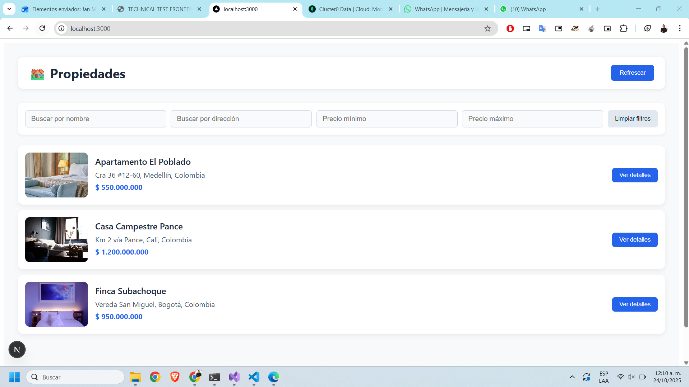
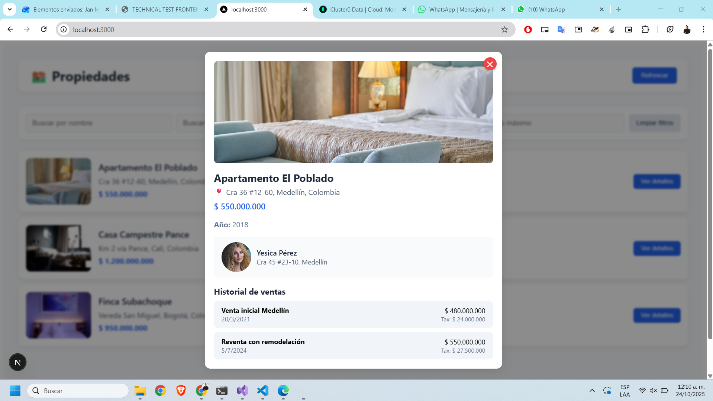
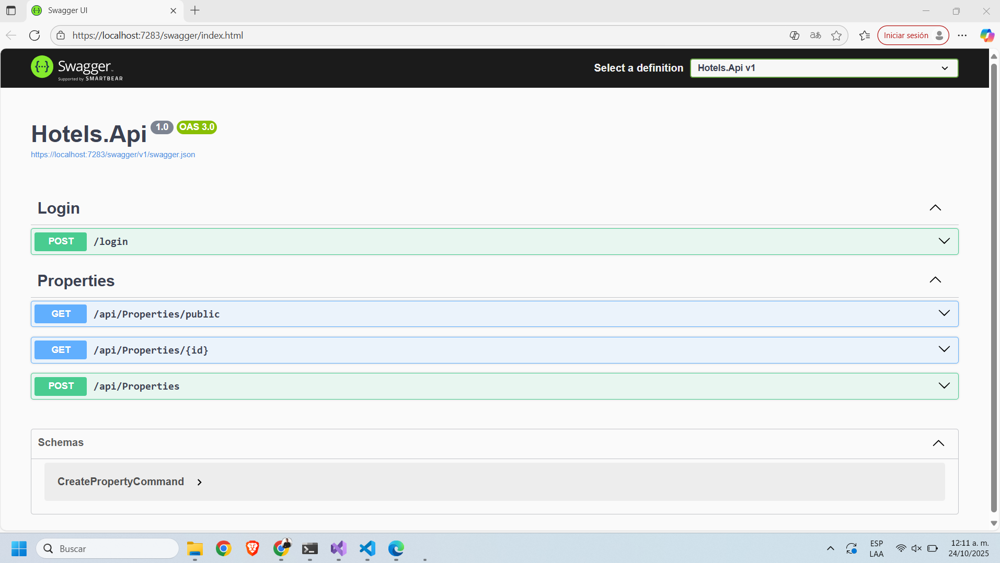
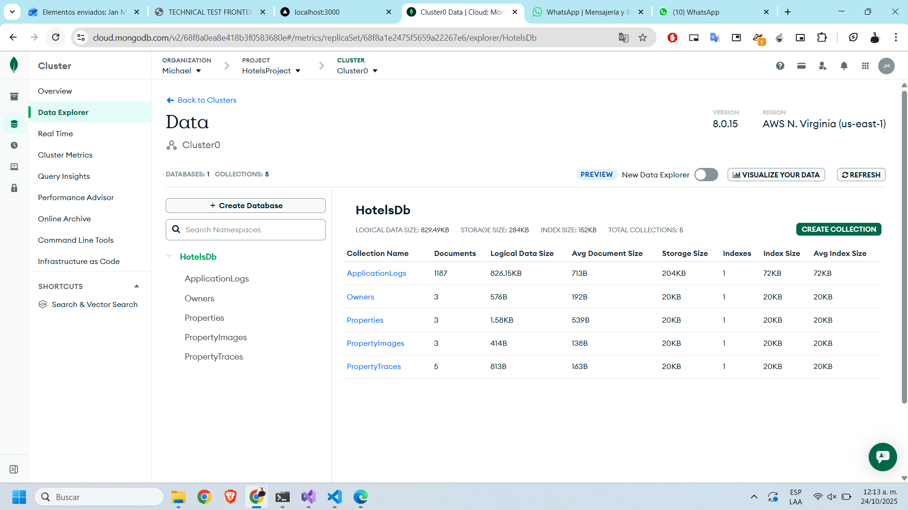

# 🏨 Hotels Solution

**Hotels Solution** es una plataforma moderna para la gestión de propiedades hoteleras, desarrollada con **.NET 8 (C#)** en el backend y **Next.js 16.0.0 (TypeScript)** en el frontend.
El proyecto aplica principios **DDD (Domain-Driven Design)**, **CQRS**, **SOLID**, **Clean Architecture**, y utiliza **JWT Bearer Authentication** para la seguridad, y MongoDB Atlas como base de datos NoSQL principal.

---

## 🧩 Arquitectura del Proyecto

La solución está compuesta por múltiples capas bien definidas, organizadas bajo una estructura monorepo:

```
.
├── .github/workflows/          # CI/CD y automatización (GitHub Actions)
├── frontend/                   # Aplicación Next.js (Interfaz de usuario)
│   ├── public/                 # Recursos estáticos
│   ├── src/
│   │   ├── app/                # Rutas y layouts (App Router)
│   │   ├── components/         # Componentes reutilizables
│   │   ├── domain/             # Tipos y entidades del dominio en el frontend
│   │   ├── features/properties # Módulos de gestión de propiedades
│   │   ├── hooks/              # Hooks personalizados
│   │   ├── store/              # Estado global (Zustand/Redux)
│   ├── next.config.ts          # Configuración Next.js
│   ├── eslint.config.mjs       # Reglas de linting
│   ├── tsconfig.json           # Configuración TypeScript
│   ├── package.json            # Dependencias del frontend
│   └── README.md
│
├── Hotels.Api/                 # Capa de presentación (API REST .NET 8)
│   ├── Controllers/            # Controladores de endpoints
│   ├── Properties/             # Endpoints relacionados con propiedades
│   ├── Program.cs              # Punto de entrada principal
│   ├── appsettings.json        # Configuración general
│
├── Hotels.Application/         # Capa de aplicación (casos de uso)
│   ├── Commands/               # Comandos CQRS
│   ├── DTOs/                   # Objetos de transferencia de datos
│   ├── Handlers/               # Manejadores de comandos y consultas
│   ├── Interfaces/             # Contratos y abstracciones
│   ├── Mapping/                # Configuración de AutoMapper
│   ├── Queries/                # Consultas CQRS
│   ├── Validators/             # Validaciones con FluentValidation
│
├── Hotels.Domain/              # Capa de dominio (entidades y lógica central)
│   ├── Entities/               # Entidades del dominio
│   ├── ValueObjects/           # Objetos de valor inmutables
│
├── Hotels.Infrastructure/      # Capa de infraestructura (persistencia y acceso a datos)
│   ├── Persistence/            # Configuración de base de datos (EF Core)
│   ├── Repositories/           # Implementaciones de repositorios
│   ├── Seed/                   # Semillas de datos iniciales
│   ├── Serializers/            # Serialización y deserialización
│
├── Hotels.SharedKernel/        # Componentes compartidos entre capas
│   ├── DomainException.cs      # Excepciones del dominio
│   ├── Result.cs               # Patrón Result<T> para respuestas seguras
│
├── tests/Hotels.Application.Tests/
│   ├── Handlers/               # Pruebas de los manejadores
│
├── .gitignore
├── README.md
└── Hotels.Api.sln
```

---

## 🚀 Tecnologías Clave

### 🖥️ **Frontend**

* **Next.js 16.0.0**
* **TypeScript**
* **Redux Toolkit**
* **Axios** (cliente HTTP)
* **React Query** (manejo de datos)

### ⚙️ **Backend (.NET 8)**

* **ASP.NET Core Web API**
* **FluentValidation**
* **AutoMapper**
* **JWT Bearer Authentication**
* **CQRS con MediatR**
* **DDD y Clean Architecture**

### 🧪 **Testing**

* **xUnit / NUnit** (backend)

---

## 🔒 Seguridad

El sistema implementa **autenticación y autorización basada en JWT Bearer**, con políticas personalizadas en los controladores:

```csharp
[Authorize(Policy = "RequireAdmin")]
public IActionResult SecureEndpoint() => Ok("Acceso concedido");

## 🧠 Principios de Diseño

* **DDD (Domain Driven Design)** → separación clara entre dominio, aplicación, infraestructura y presentación.
* **CQRS (Command Query Responsibility Segregation)** → comandos y consultas gestionados por `MediatR`.
* **SOLID Principles** → código modular, testeable y escalable.
* **Clean Architecture** → independencia de frameworks y persistencia.

## ⚙️ Configuración y Ejecución

### 🧩 Backend (.NET 8)

```bash
cd Hotels.Api
dotnet restore
dotnet build
dotnet run
```

Accede a la API en:
👉 [https://localhost:7283/swagger/index.html]

---

### 💻 Frontend (Next.js)

```bash
cd frontend
npm install
npm run dev
```

Accede a la web en:
👉 `http://localhost:3000`

---

## 🧪 Ejecutar Pruebas

### Backend:

```bash
dotnet test tests/Hotels.Application.Tests
```

🗄️ Base de Datos (MongoDB Atlas)


La solución utiliza MongoDB Atlas, un servicio cloud administrado, con una base principal llamada:

🧱 HotelsDb

"Collections": { "Owners": "Owners", "Properties": "Properties", "PropertyImages": "PropertyImages", "PropertyTraces": "PropertyTraces", "Logs": "ApplicationLogs" }

---

## 📦 CI/CD

El repositorio incluye flujos en `.github/workflows/` para:

* **Build & Test** automático.
* **Deploy** a entornos de staging o producción.
* **Linting y validación de PRs.**


## 👥 Autor

**Jan Michael Sánchez**
Desarrollador de software especializado en soluciones distribuidas, arquitectura limpia y desarrollo web fullstack.

📧 **Contacto:** [[maicol_931028@hotmail.com](mailto:maicol_931028@hotmail.com)]
🌐 **GitHub:** [@maicol9310](https://github.com/maicol9310)

---







